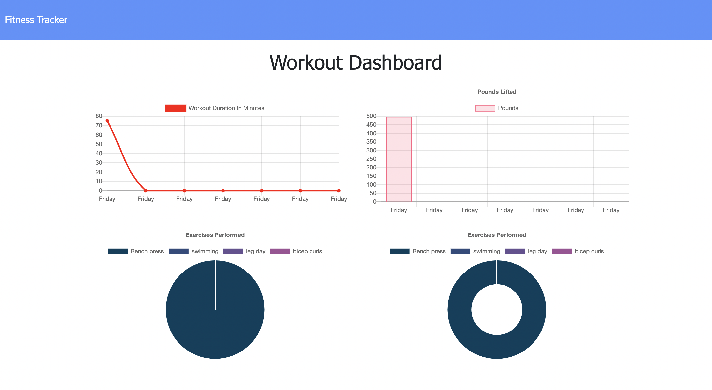

# fitness-tracker

This fitness tracker allows you to create new workouts, add to existing ones, track your exercises, and read your workout history with graphs. This application is deployed to Heroku and connected to MongoDB Atlas to store workout data. 

---

---

[Fitness tracker site](https://safe-fortress-71548.herokuapp.com/)